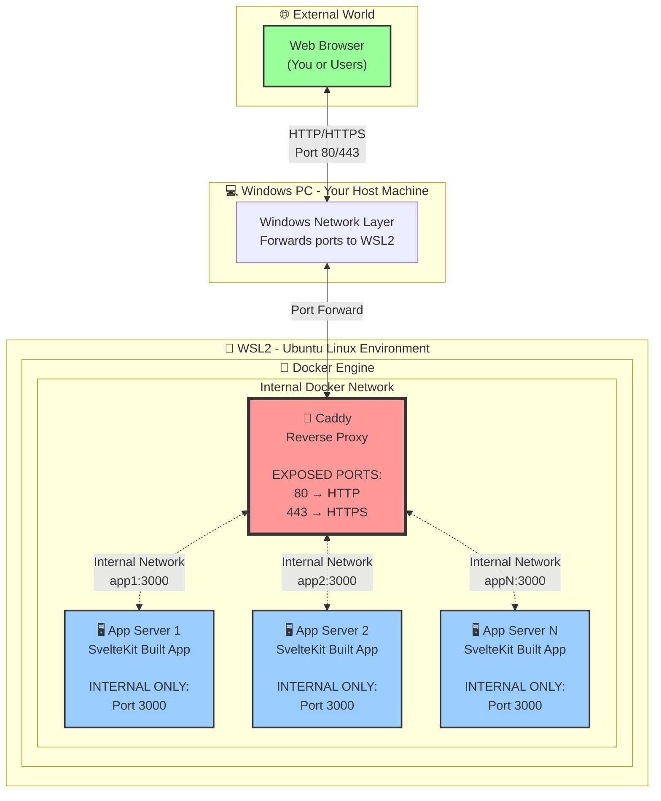
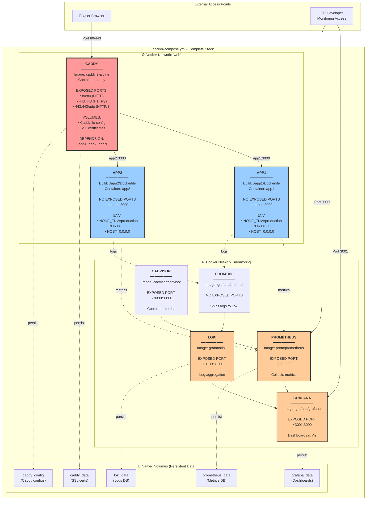
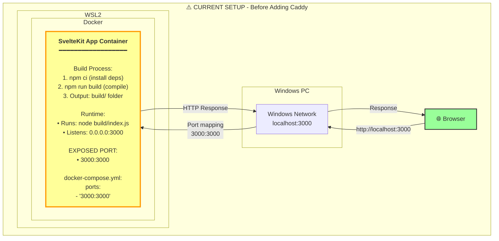
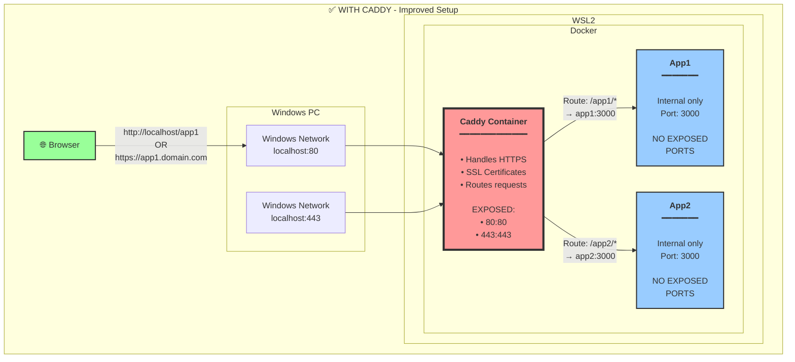

# System Architecture - Three Perspectives

## Diagram 1: High-Level General Architecture

This shows the big picture of how everything connects:



**Key Points:**
- 🚦 **Only Caddy** exposes ports to the outside world (80, 443)
- 🖥️ **App servers** are hidden behind Caddy, accessible only internally
- 🔒 **Security**: Direct access to apps is impossible from outside
- 📡 **Routing**: Caddy decides which app handles each request

---

## Diagram 2: Detailed Docker Compose Architecture

This shows the complete production setup with all services:



**Services Breakdown:**

| Service | Purpose | Exposed Ports | Access From Windows |
|---------|---------|---------------|---------------------|
| **Caddy** | Reverse Proxy | 80, 443 | `http://localhost` |
| **app1** | SvelteKit App 1 | NONE | Via Caddy only |
| **app2** | SvelteKit App 2 | NONE | Via Caddy only |
| **Grafana** | Monitoring UI | 3001 | `http://localhost:3001` |
| **Prometheus** | Metrics DB | 9090 | `http://localhost:9090` |
| **Loki** | Log Storage | 3100 | Internal only |
| **Promtail** | Log Collector | NONE | Internal only |
| **cAdvisor** | Container Stats | 8080 | `http://localhost:8080` |

---

## Diagram 3: Current Setup (Before Caddy) - Direct Port Exposure

This shows how your SvelteKit app currently works with ports directly exposed:



**How It Currently Works:**

1. **Docker Build Stage** (happens once):
   ```bash
   docker compose build
   ```
   - Copies SvelteKit source code into container
   - Runs `npm ci` to install dependencies
   - Runs `npm run build` to compile app
   - Creates production build in `build/` directory
   - Final image = Node.js + built app

2. **Docker Run Stage** (happens when you start):
   ```bash
   docker compose up -d
   ```
   - Container starts
   - Executes: `node build` (runs the built SvelteKit app)
   - SvelteKit Node server listens on `0.0.0.0:3000`
   - Docker maps container port 3000 → host port 3000
   - WSL2 forwards port 3000 to Windows

3. **Request Flow**:
   ```
   Browser → localhost:3000 → Windows → WSL2 → Docker → Container:3000 → Node.js → SvelteKit App → Response
   ```

**Problems with This Approach:**

❌ **No HTTPS** - Only HTTP (not secure)
❌ **Port Conflicts** - Each app needs unique port (3000, 3001, 3002...)
❌ **Ugly URLs** - Users must remember port numbers
❌ **No SSL Certificates** - Can't get Let's Encrypt certs
❌ **Direct Exposure** - App directly faces internet (less secure)
❌ **No Load Balancing** - Can't run multiple instances

---

## After Adding Caddy - The Improved Architecture



**Benefits with Caddy:**

✅ **Automatic HTTPS** - Free SSL certificates
✅ **Single Port** - Everything through port 80/443
✅ **Clean URLs** - `app1.domain.com` or `localhost/app1`
✅ **Security** - Apps hidden behind proxy
✅ **Load Balancing** - Can run multiple app instances
✅ **Professional** - Production-ready setup

---

## Summary

**Three Diagrams Explained:**

1. **High-Level Architecture**: The 30,000-foot view of browser → Caddy → apps
2. **Detailed Docker Compose**: All services, ports, networks, and volumes in your stack
3. **Current vs Future**: How direct port exposure works now, and how Caddy improves it

**Ready to implement Caddy?** 🚀
